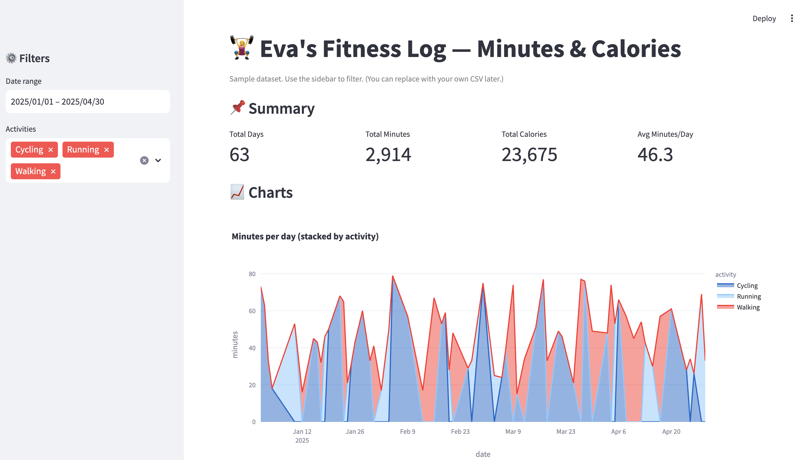
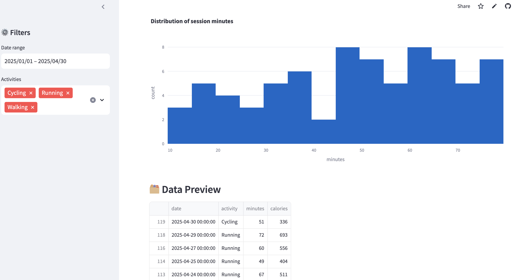

🏋️‍♀️ Eva’s Fitness Dashboard

A Streamlit-powered interactive dashboard to visualize sample fitness data (workouts, minutes, and calories). Built with Python, Pandas, NumPy, and Plotly.

🔗 Live Demo: https://fitness-dashboard-clean-28fkggo8uqqtrasctr6ptm.streamlit.app/

📂 Source Code: GitHub Repo

📂 Source Code: https://github.com/eva1815/fitness-dashboard-clean

📊 Features

Sample Fitness Log: Auto-generated dataset of workouts, minutes, and calories

Interactive Charts: Filter by date range or activity

Visualization Tools: Built with Plotly for modern, interactive graphs

Deployed on Streamlit Cloud for instant access

📸 Screenshots

🛠 Tech Stack

Python 3.11

Streamlit – App framework

Pandas – Data analysis

NumPy – Data generation

Plotly – Interactive charts

🚀 Run Locally

1. Clone the repo:

git clone https://github.com/eva1815/fitness-dashboard-clean.git
cd fitness-dashboard-clean

2. Create a virtual environment:

python -m venv .venv
source .venv/bin/activate   # Mac/Linux
.venv\Scripts\activate      # Windows

3. Install dependencies:

pip install -r requirements.txt

4. Run the app:

streamlit run streamlit_app.py

📌 About

This project is part of my portfolio roadmap to demonstrate skills in data visualization, web apps, and cloud deployment.
